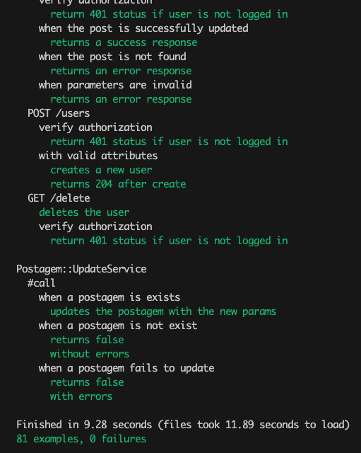
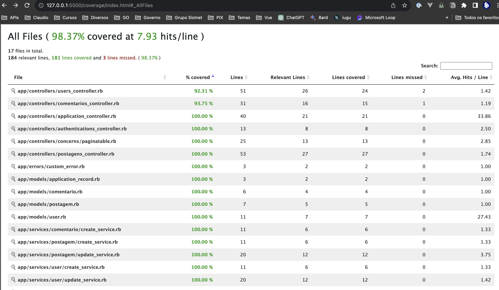

# API Ruby on Rails - Mini Projeto de Postagem e Comentários

Mini projeto de API que possibilita realizar o cadastro de usuário, postagens e comentários

## <u>**Pré-requisitos**</u>

Liste o que é necessário para instalar e executar o projeto, por exemplo:
- Ruby 3.2.2
- Rails 7.0.8
- PostgreSQL 15

## <u>**Instalação**</u>

Descreva os passos para instalar e configurar o projeto. Por exemplo:

```sh
git clone https://github.com/claudiojsantos/post.git - https
git clone git@github.com:claudiojsantos/post.git - ssh

cd post
bundle install
rails db:create db:migrate
rails s
```

Existe um conjunto de dados pré-cadastrados para testes, para carregá-los execute o comando abaixo:

```sh
rails db:seed
```  
ou
```sh
rails db:setup
rails db:reset
```

Para executar os testes automatizados, execute o comando abaixo:

```sh
rspec
```



Ao executar o comando acima, será gerado um relatório de cobertura de testes, que pode ser visualizado no arquivo `coverage/index.html`



## <u>**Utilização**</u>

Com o conjunto de dados pré-cadastrados, é possível realizar as seguintes operações:

**<div align="center">EndPoints Protegidos (Requerem Autenticação):</div>**

### **Postagens**

| Método | Rota               | Descrição                          |
|--------|--------------------|------------------------------------|
| GET    | `/postagens`       | Retorna todos as postagens         |
| GET    | `/postagens/:id`   | Retorna uma postagem específica    |
| POST   | `/postagens`       | Cria um nova postagem              |
| PUT    | `/postagens/:id`   | Atualiza uma postagem específico   |
| DELETE | `/postagens/:id`   | Exclui uma postagem específico     |

### Exemplo de requisição para criação de uma postagem:

- Header:
  - Authorization: Bearer {token}

### POST E PUT

```json
{
    "postagem": {
        "titulo": "",
        "texto": "testando 4, 5, 6"
    }
}
```

---
### **Comentários**

| Método | Rota               | Descrição                          |
|--------|--------------------|------------------------------------|
| GET    | `/comentarios`     | Retorna todos os comentários       |
| GET    | `/comentarios/:id` | Retorna um comentário específico   |

### Exemplo de requisição para criação de um comentário:

- Header:
  - Authorization: Bearer {token}

---
### **Usuários**

| Método | Rota               | Descrição                          |
|--------|--------------------|------------------------------------|
| GET    | `/usuarios`        | Retorna todos os usuários          |
| GET    | `/usuarios/:id`    | Retorna um usuário específico      |
| POST   | `/usuarios`        | Cria um novo usuário               |
| PUT    | `/usuarios/:id`    | Atualiza um usuário específico     |
| DELETE | `/usuarios/:id`    | Exclui um usuário específico       |

---

**<div align="center">Endpoints Públicos (Não Requerem Autenticação)</div>**
### **Login**

| Método | Rota               | Descrição                          |
|--------|--------------------|------------------------------------|
| POST   | `/login`           | Realiza o login do usuário         |

### Exemplo de requisição para login:

### POST

```json
{
    "email": "author@test.com",
    "password": "12345678"
}
```

### **Comentários**

| Método | Rota               | Descrição                          |
|--------|--------------------|------------------------------------|
| POST   | `/comentarios`     | Cria um novo comentário            |

### Exemplo de requisição para criação de um comentário:

### POST

```json
{
    "comentario": {
        "nome": "Adelina Fisher",
        "comentario": "Atque sit tempora rerum.",
        "postagem_id": 11
    }
}
```

---
**Cláudio Santos**  
**claudio@sistnet.com.br**.  
Linkedin: **https://www.linkedin.com/in/claudio-santos-3b071140/**

